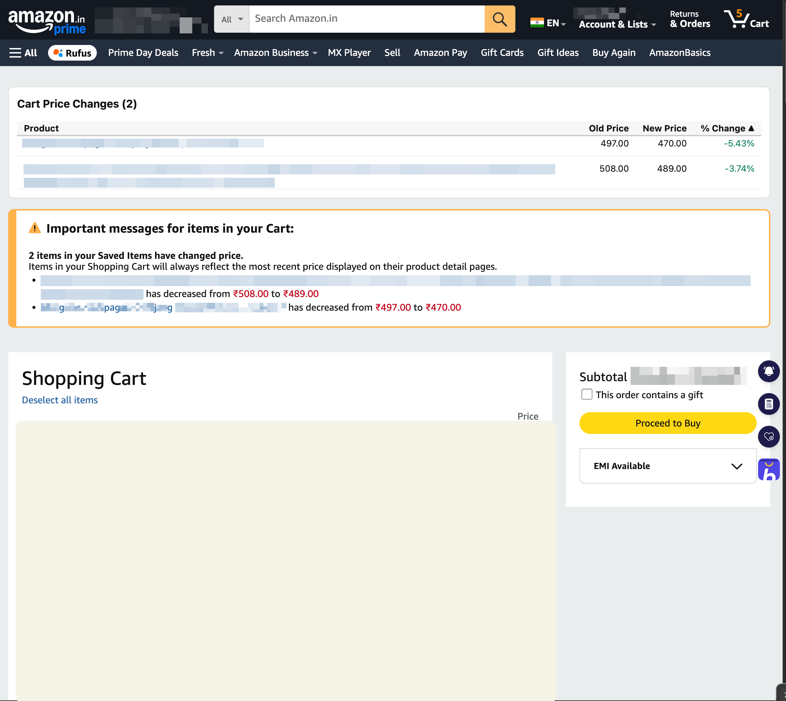

# CartLens — Amazon Cart Price Tracker & Price Drop Alert Extension

**See every price change in your Amazon Cart at a glance — sorted, in one table.**

CartLens is a free, open-source Chrome extension (Manifest V3) that tracks the
price of every item in your Amazon Cart — including Saved-for-Later — and shows
it in a clean, sortable price comparison table: product thumbnail and name
(linked), previous price, current price, and percent change — so the best price
drops (and the sneaky price increases) jump out immediately. It remembers prices
between visits, so it builds each item's price history for you over time. No
sign-up, no price-tracking account, no external service — it just reads the cart
page you already have open and stores history locally in your browser.

## Features

- **Fully automatic** — the table appears as soon as you load your Amazon Cart
  page. No click required.
- **Tracks Cart *and* Saved-for-Later** — every item with a price shows up, each
  tagged with its section.
- **Price history over time** — CartLens records prices between visits, so it
  builds a running history for each item even if Amazon shows no change notice.
  Click any row to expand its full price history with timestamps.
- **Product thumbnails** — each row shows the item's image for quick recognition.
- **Sortable columns** — click any header (Product, Section, Prev Price, Current
  Price, % Change) to sort ascending/descending.
- **Sorted by biggest change first** — by default, items are ranked by percent
  change so the largest price drops surface immediately.
- **Color-coded** — price drops in green, increases in red, unchanged dimmed.
- **Collapsible** — click the heading to collapse the whole table out of the way.
- **Per-item clear** — dismiss any item to drop it (and its stored history) from
  the table.
- **Works across Amazon storefronts** — .com, .in, .co.uk, .de, .ca, .fr, .it,
  .es, .co.jp, .com.au, .com.mx, .com.br, .nl, .se, .pl, .sg, .ae, .sa.
- **Private by design** — runs entirely client-side. History is stored only in
  your browser's local storage. No data leaves your browser, no analytics, no
  external requests.

## Installation

### From the Chrome Web Store

_(coming soon — link will go here once published)_

### Manual install (load unpacked)

1. Clone or [download this repo](../../archive/refs/heads/main.zip).
2. Open `chrome://extensions` in Chrome (or any Chromium browser — Edge,
   Brave, Arc).
3. Enable **Developer mode** (top-right toggle).
4. Click **Load unpacked** and select the `cartlens/` folder.
5. Visit your [Amazon Cart](https://www.amazon.com/gp/cart/view.html) — the
   table appears automatically above the existing price-change notices.

## How it works

CartLens is a Manifest V3 content script. On each cart page it scrapes every
active and saved-for-later line item using Amazon's own `data-asin` /
`data-price` attributes (more reliable than the visible price spans), reading
the product link, image, and current price for each. It merges those prices into
a per-item history kept in `chrome.storage.local`, appending a new point only
when a price actually changes (capped at 50 points per item). Each row's
previous vs. current price gives the percent change, and the table is rendered
above Amazon's existing cart content. A debounced `MutationObserver` re-renders
when Amazon updates the cart asynchronously (e.g. as Saved-for-Later lazy-loads
on scroll).

No network requests, no remote code, no tracking — everything happens in the
page you already have open, and history never leaves your browser.

## Contributing

Bug reports and PRs are welcome — see [CONTRIBUTING.md](CONTRIBUTING.md).

Amazon frequently A/B tests its cart page markup, so selector breakage is the
most common type of bug. If your table stops appearing, please open an issue
with a sanitized HTML snippet of the "Important messages" section (strip your
personal data first).

## Privacy

CartLens requests `activeTab`, `scripting`, and `storage` permissions, plus host
permissions scoped to Amazon cart pages only. Price history is stored locally via
`chrome.storage.local` and never transmitted anywhere. It does not collect or
transmit any data. See [PRIVACY.md](PRIVACY.md) for the full policy (required for
Chrome Web Store listing).

## License

[MIT](LICENSE)

---

Keywords: Amazon price tracker, Amazon cart price drop, price change
notification extension, Amazon price history, price drop alert, Amazon price
comparison table, browser extension for Amazon shopping, camelcamelcamel
alternative, Amazon deal finder, sortable price table.
